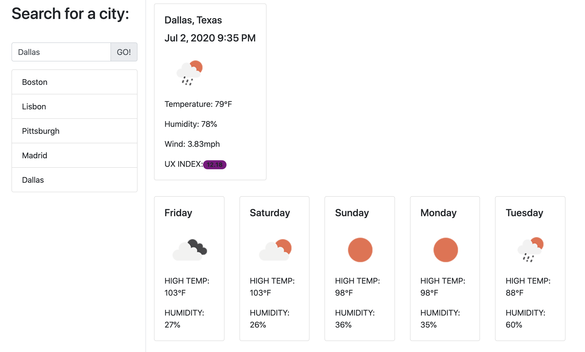

This is a simple weather app that connects to the openweathermap API. It shows the search history, the next 5 days forcast, and the current weather for a given location.

Areas for improvement:
-- I spent too much time trying to manipulate local storage to limit the number of searches in the search history and eliminating duplicate searches.
-- After the search box pings the API, clear the search box of the previous search
-- fixed exception manager for API call 

Link to deployed URL: https://grburner.github.io/week6_hw/
Link to git repo: https://github.com/grburner/week6_hw